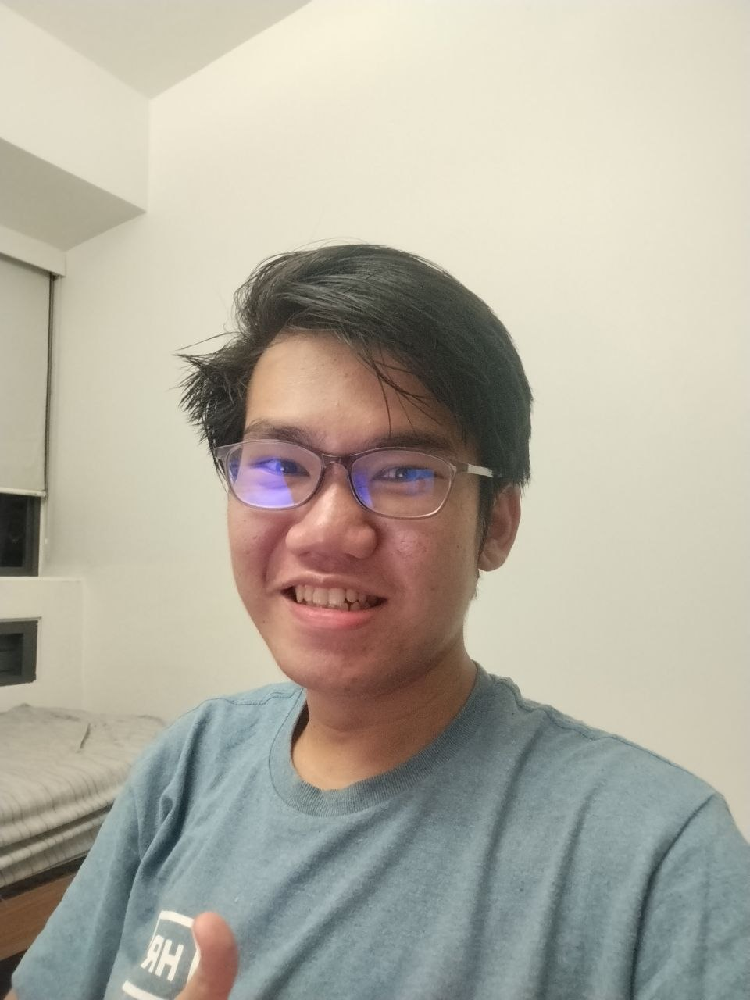
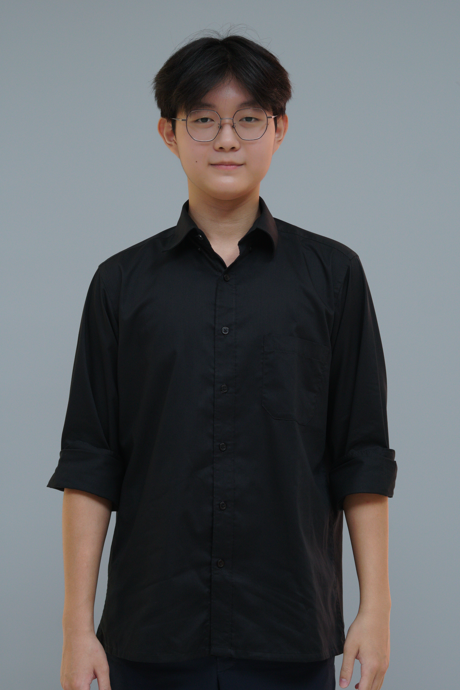
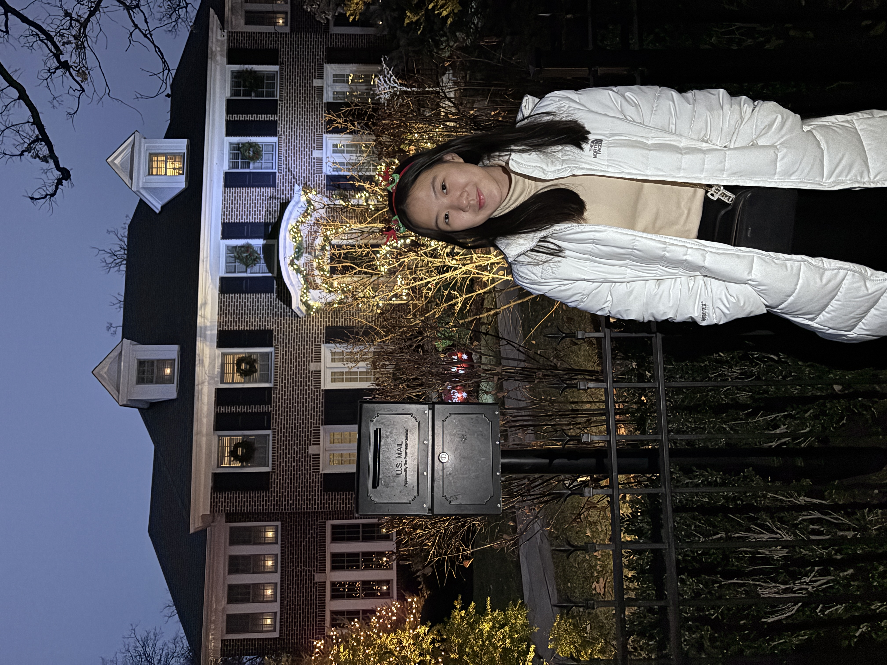
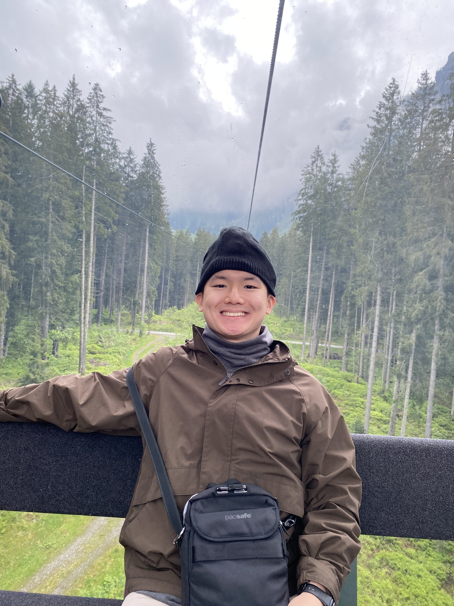
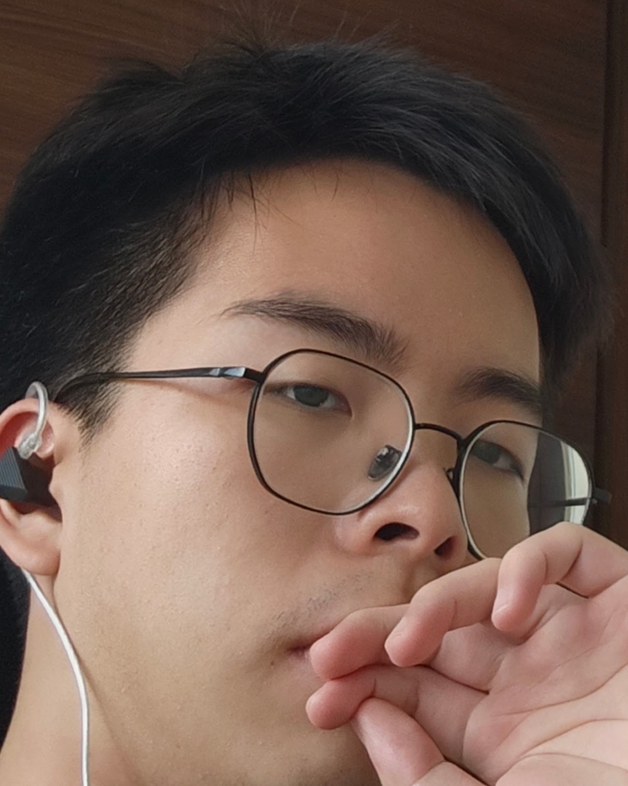

We are a team based in the [School of Computing, National University of Singapore](https://www.comp.nus.edu.sg).

## Project team

### Calvin Yoel Pandiangan

[[GitHub](https://github.com/CAYOPAN)]

* Role: Testing & Code Quality Lead
* Responsibilities: Exit, delete, and find commands.

### Eron Dathan

[[GitHub](https://github.com/rondth)]

* Role: Integration Lead
* Responsibilities: Automatic saving and planned tag filtering (`filter`).

### Glory Charity Lion

[[GitHub](https://github.com/glory-lion)]

* Role: Documentation Lead
* Responsibilities: Manual data-file editing and planned bulk tag editing.

### Ian Abiel Wangsa

[[GitHub](https://github.com/Manutd1234)]

* Role: Team Lead
* Responsibilities: List members (`list`) and clear the roster (`clear`).

### Noah

[[GitHub](https://github.com/Asdao)]

* Role: Developer Lead
* Responsibilities: CLI workflows for adding and editing member records, and command help.
