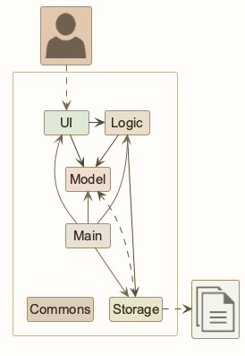
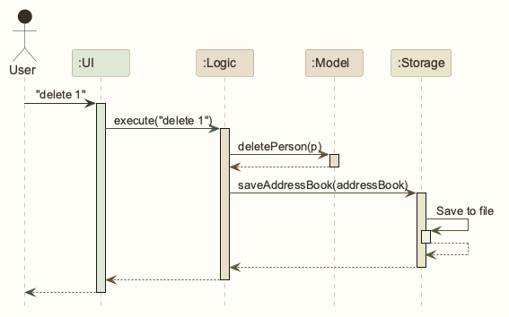
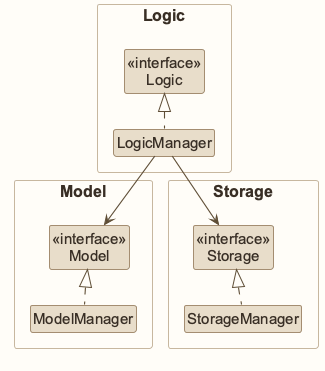
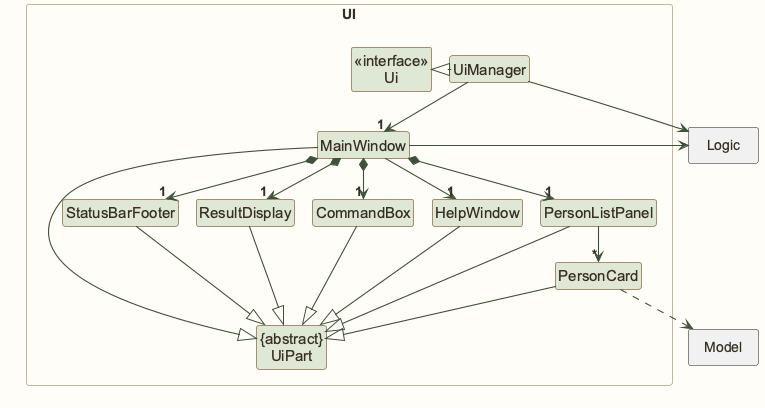
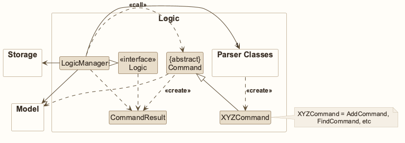
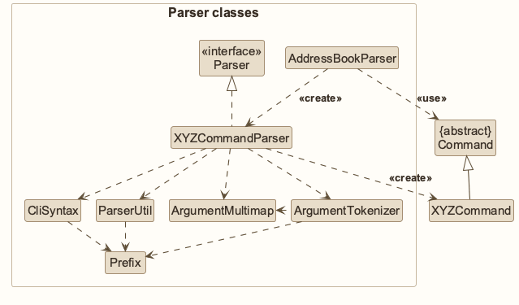
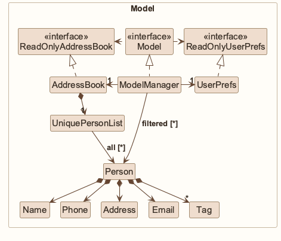
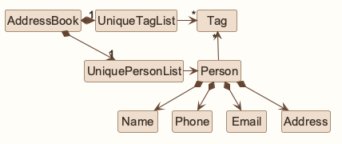
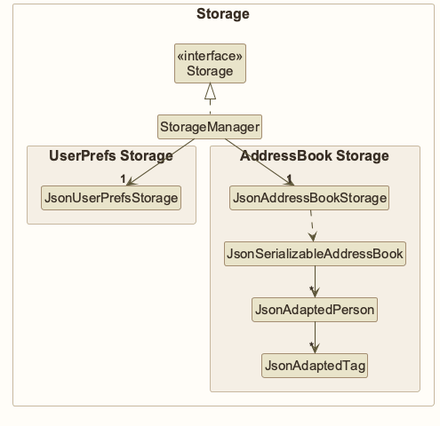
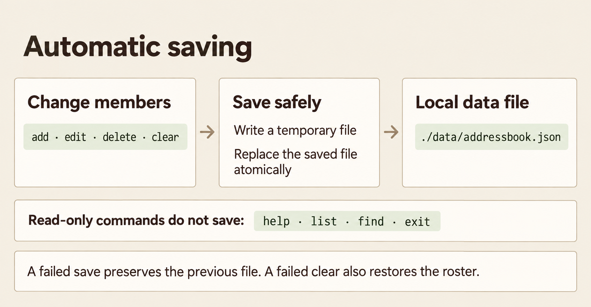

* Table of Contents
{:toc}

--------------------------------------------------------------------------------------------------------------------

## **Acknowledgements**

* TrackCall builds on [AddressBook Level 3](https://se-education.org/addressbook-level3/) by the
  [SE-EDU initiative](https://se-education.org/). The starter supplies the architecture, source code, tests,
  and original diagrams.
* The application uses [JavaFX](https://openjfx.io/) for its interface and
  [Jackson](https://github.com/FasterXML/jackson) for JSON storage.
* [JUnit](https://junit.org/junit5/), [Gradle](https://gradle.org/),
  [Checkstyle](https://checkstyle.org/), and [JaCoCo](https://www.jacoco.org/jacoco/) support testing and builds.

--------------------------------------------------------------------------------------------------------------------

## **Setting up, getting started**

Refer to the guide [_Setting up and getting started_](SettingUp.md).

--------------------------------------------------------------------------------------------------------------------

## **Design**

<div markdown="span" class="alert alert-primary">

:bulb: **Tip:** The `.puml` files used to create diagrams are in `docs/diagrams`. Refer to the [_PlantUML Tutorial_ at se-edu/guides](https://se-education.org/guides/tutorials/plantUml.html) to learn how to create and edit diagrams.
</div>

### Architecture



The ***Architecture Diagram*** given above explains the high-level design of the App.

The following provides a quick overview of the main components and their interactions.

**Main components of the architecture**

**`Main`** (consisting of classes [`Main`](https://github.com/AY2627S1-CS2103T-W12-1/tp/tree/master/src/main/java/seedu/address/Main.java) and [`MainApp`](https://github.com/AY2627S1-CS2103T-W12-1/tp/tree/master/src/main/java/seedu/address/MainApp.java)) is in charge of the app launch and shut down.
* At app launch, it initializes the other components in the correct sequence, and connects them up with each other.
* At shut down, it shuts down the other components and invokes cleanup methods where necessary.

The bulk of the app's work is done by the following four components:

* [**`UI`**](#ui-component): The UI of the App.
* [**`Logic`**](#logic-component): The command executor.
* [**`Model`**](#model-component): Holds the data of the App in memory.
* [**`Storage`**](#storage-component): Reads data from, and writes data to, the hard disk.

[**`Commons`**](#common-classes) represents a collection of classes used by multiple other components.

**How the architecture components interact with each other**

The *Sequence Diagram* below shows how the components interact with each other for the scenario where the user issues the command `delete 1`.



Each of the four main components (also shown in the diagram above),

* defines its *API* in an `interface` with the same name as the Component.
* provides its functionality through a concrete `{Component Name}Manager` class that implements the corresponding API interface.

For example, the `Logic` component defines its API in `Logic.java` and implements it in `LogicManager.java`. Other components interact with a component through its interface rather than its concrete class, preventing them from coupling to that component's implementation, as illustrated in the following partial class diagram.



The sections below give more details of each component.

### UI component

The **API** of this component is specified in [`Ui.java`](https://github.com/AY2627S1-CS2103T-W12-1/tp/tree/master/src/main/java/seedu/address/ui/Ui.java)



The UI consists of a `MainWindow` and its parts, such as `CommandBox`, `ResultDisplay`, `PersonListPanel`, and `StatusBarFooter`. All of these, including `MainWindow`, inherit from the abstract `UiPart` class, which captures common behavior among classes that represent visible GUI parts.

The `UI` component uses the JavaFX UI framework. The layouts of these UI parts are defined in matching `.fxml` files in `src/main/resources/view`. For example, [`MainWindow.fxml`](https://github.com/AY2627S1-CS2103T-W12-1/tp/tree/master/src/main/resources/view/MainWindow.fxml) specifies the layout of [`MainWindow`](https://github.com/AY2627S1-CS2103T-W12-1/tp/tree/master/src/main/java/seedu/address/ui/MainWindow.java).

The `UI` component,

* executes user commands using the `Logic` component.
* listens for changes to `Model` data so that the UI can be updated with the modified data.
* keeps a reference to the `Logic` component, because the `UI` relies on the `Logic` to execute commands.
* depends on some classes in the `Model` component because it displays `Person` objects from the model.

### Logic component

**API** : [`Logic.java`](https://github.com/AY2627S1-CS2103T-W12-1/tp/tree/master/src/main/java/seedu/address/logic/Logic.java)

Here's a (partial) class diagram of the `Logic` component:



The sequence diagram below illustrates the interactions within the `Logic` component, taking `execute("delete 1")` API call as an example.


<div markdown="span" class="alert alert-info">:information_source: **Note:** The lifeline for `DeleteCommandParser` should end at the destroy marker (X), but due to a limitation of PlantUML, it continues to the end of the diagram.
</div>

How the `Logic` component works:

1. When `Logic` is called upon to execute a command, the command is passed to an `AddressBookParser` object, which in turn creates a parser that matches the command (e.g., `DeleteCommandParser`) and uses it to parse the command.
1. This results in a `Command` object (more precisely, an object of one of its subclasses e.g., `DeleteCommand`) which is executed by the `LogicManager`.
1. The command can communicate with the `Model` when it is executed (e.g. to delete a person).<br>
   Note that although this is shown as a single step in the diagram above for simplicity, the code can require several interactions between the command object and the `Model` to complete the operation.
1. The result of the command execution is encapsulated as a `CommandResult` object which is returned from `Logic`.

Here are the other classes in `Logic` (omitted from the class diagram above) that are used for parsing a user command:



How the parsing works:
* When called upon to parse a user command, the `AddressBookParser` class creates an `XYZCommandParser` (`XYZ` is a placeholder for the specific command name, e.g., `AddCommandParser`). The parser uses the other classes shown above to parse the user command and create an `XYZCommand` object (e.g., `AddCommand`). The `AddressBookParser` returns that object as a `Command` object.
* All `XYZCommandParser` classes, such as `AddCommandParser` and `DeleteCommandParser`, implement the `Parser` interface so they can be treated similarly where appropriate, for example during testing.

### Model component
**API** : [`Model.java`](https://github.com/AY2627S1-CS2103T-W12-1/tp/tree/master/src/main/java/seedu/address/model/Model.java)




The `Model` component,

* stores the address book data i.e., all `Person` objects (which are contained in a `UniquePersonList` object).
* stores the `Person` objects selected by the current filter, such as search results, in a separate _filtered_ list. It exposes this list as an unmodifiable `ObservableList<Person>` that the UI can observe and bind to, so the UI updates when the list changes.
* stores a `UserPrefs` object that represents the user’s preferences (currently, just the GUI settings). This is exposed to the outside as a `ReadOnlyUserPrefs` object.
* does not depend on any of the other three components (as the `Model` represents data entities of the domain, they should make sense on their own without depending on other components)

<div markdown="span" class="alert alert-info">:information_source: **Note:** The alternative, arguably more object-oriented, design below keeps a unique list of tags in `AddressBook`, and each `Person` references tags from that list. This lets `AddressBook` maintain one `Tag` object per unique tag instead of each `Person` holding its own `Tag` objects.<br>



</div>


### Storage component

**API** : [`Storage.java`](https://github.com/AY2627S1-CS2103T-W12-1/tp/tree/master/src/main/java/seedu/address/storage/Storage.java)



The `Storage` component,
* can save both address book data and user preference data in JSON format, and read them back into corresponding objects.
* is implemented by `StorageManager`, which delegates the actual JSON file access to `JsonAddressBookStorage` and `JsonUserPrefsStorage` (one class per data file).
* depends on some classes in the `Model` component (because the `Storage` component's job is to save/retrieve objects that belong to the `Model`)

### Common classes

Classes used by multiple components are in the `seedu.address.commons` package.

--------------------------------------------------------------------------------------------------------------------

## **Implementation**

This section describes the v1.2 working branch. The v1.1 iteration was limited to documentation;
these functional changes are not a published v1.1 release. The requirements appendix records the
full intended product, including behaviour still to be implemented.

### Offline command help

`CommandHelp` stores one local catalogue of the eight implemented commands, including each command's
purpose, syntax, example, expected result, and common errors. `HelpCommandParser` accepts zero or one
lowercase topic and rejects unknown or multiple topics. `HelpCommand` returns the topic in `CommandResult`,
and `MainWindow` passes it to `HelpWindow`.

The help overview groups the eight commands into four compact category cards. Each command shows a
purpose title, runnable example, and an in-app button for opening its details. The overview reflows
from two columns to one in a narrower window. `help COMMAND` opens the same detailed command card;
All commands returns to the overview. F1 and the menu open the overview. Arrow and page keys scroll,
Home/End move to the ends, and Escape closes help. The catalogue lists only executable commands,
so planned tag commands cannot be mistaken for available functionality. `CommandHelpTest` checks
catalogue completeness and executable examples; `HelpWindowTest` checks the rendered overview,
every detail page, responsive columns, navigation, and keyboard scrolling. `MainWindowTest`
exercises `help add`, F1, Escape, exit, rejected `/help`, and failed-save recovery through the real
command box with temporary storage.

### Ian's list and clear commands

`ListCommand` resets the model predicate to `PREDICATE_SHOW_ALL_PERSONS`, keeps stored order,
and reports the complete count using singular, plural, or empty-roster wording. `LogicManager`
returns its result without invoking storage. Extra arguments are rejected by `AddressBookParser`
before either the view or data changes. Member cards use labelled, wrapping rows and tags, with
`LightTheme.css` providing the beige main-list palette. The offline guide is described above.

Before executing `ClearCommand`, `LogicManager` snapshots the roster. The command counts and
removes all records while retaining the old predicate temporarily. After saving succeeds, the
logic layer resets the predicate to show all and returns the success message. On an `IOException`,
it restores the snapshot; retaining the original predicate restores the previous displayed view,
including an empty search result. Settings are never changed. An already-empty clear still saves.

To meet clear's previous-file preservation requirement, `FileUtil#writeToFile` writes UTF-8 to a
sibling temporary file and atomically replaces the destination. `JsonAddressBookStorage` no longer
pre-creates an empty destination. Unsupported atomic replacement produces a handled failure;
there is no unsafe partial-write fallback. This shared storage helper also benefits existing
callers; their command policies and load validation are described below.

Exact feedback follows Ian's feature specification:

| Case | Feedback |
| --- | --- |
| List zero members | `No members in the address book.` |
| List one member | `Showing 1 member.` |
| List multiple members | `Showing N members.` |
| Invalid list arguments | `Invalid command format. Usage: list` |
| Clear zero members | `The address book is already empty. No changes were made.` |
| Clear one member | `Cleared 1 member. The address book is now empty.` |
| Clear multiple members | `Cleared N members. The address book is now empty.` |
| Invalid clear arguments | `Invalid command format. Usage: clear. This command removes all members.` |
| Failed clear save | `Unable to clear the address book because the changes could not be saved. No members were removed.` |

Regression coverage is in `ListClearIntegrationTest`, the two command tests, parser tests, and
`FileUtilTest`. `PersonCardTest` lays out member cards off-screen and verifies complete field values,
alphabetical tag order, hidden empty tag rows, and wrapping at narrow widths. Linux CI supplies a
virtual display with `xvfb-run` for JavaFX. UI integration tests use synthetic members and temporary
storage; they never open the user's roster.
Command tests cover singular/plural/empty feedback, hidden members, no-match views, order,
repetition, rejected arguments, no-save listing, persisted empty data, settings, predicate reset,
failed-save rollback, retry, and temporary-file cleanup. `filter` is not implemented here;
model predicates are used to verify integration with a future filter without claiming that command exists.

### Readable member details and feedback

`Messages#format(Person)` formats names, phone numbers, email addresses, addresses, and sorted tags
as labeled lines. Add, edit, and delete results reuse this format instead of one long semicolon-separated
message. `ResultDisplay` wraps and scrolls text; a split pane lets the user resize its area.
`PersonCard` separates the displayed index and name from labeled contact rows and wraps long values
and tag labels. The JavaFX stylesheet `LightTheme.css` supplies the shared beige palette and dark
text for the main window, help, and alerts; `HelpWindow.css` adds the help-card layout. A welcome
message points to `help` and `help add`.

Find feedback reports `Members found: N`. List and clear use the exact count messages above.
Data-changing feedback is shown only after saving. Duplicate-name errors explain the existing name rule and suggest `edit`.

`MainWindow` uses `WindowPlacement` to check saved bounds against available display areas at startup. It retains valid
positions, selects the display with the greatest overlap or the primary display as a fallback,
and brings oversized or off-screen bounds back within that display. Invalid saved dimensions
also recover to usable bounds. This handles monitor changes between sessions.

### Automatic data saving and load recovery

`LogicManager#execute(String)` parses and executes a command, then checks `Command#isReadOnly()`.
`help`, `list`, `find`, and `exit` return without saving member data. Successful `add`, `edit`, `delete`,
and `clear` commands pass the complete roster, including hidden members, to `Storage#saveAddressBook`.
Parsing and execution failures do not save. Data-changing commands return normal success only after
the save succeeds.

`StorageManager` delegates JSON storage to `JsonAddressBookStorage`. The default file is
`data/addressbook.json`, relative to the working directory. `FileUtil#writeToFile` creates missing parent
directories, writes UTF-8 to a sibling temporary file, and replaces the destination with an atomic move.
It reports a failure if atomic replacement is unavailable instead of falling back to a potentially
partial overwrite. An existing saved file remains intact on failure; temporary-file cleanup is attempted.

If saving fails, `LogicManager` reports a `SaveFailureException`, a `CommandException` subtype that
also records whether the change remains applied. For `add`, `edit`, and `delete`, the model change
remains in memory. `CommandBox` clears the already-applied input so pressing Enter cannot accidentally
repeat an indexed edit or deletion. The result explains that the previous saved roster is unchanged.
After resolving the storage problem, the user checks the current list and reapplies an existing field
value with `edit` to save without changing another record; an empty roster can be saved with `clear`.

Before `clear`, `LogicManager` snapshots the roster. A successful save resets the search predicate.
If saving fails, it restores those records while
retaining the existing search predicate, so the previous displayed list returns. The result says
`No members were removed.` and `CommandBox` retains the clear input for a deliberate retry. A failed
clear of an already-empty roster also reports failure rather than the normal empty result.
Exiting never retries a save. Application preferences are stored separately at startup and shutdown.

Startup loads a valid roster in file order, uses samples for a missing file, and uses an empty roster
after a loading error. A JSON `null` root, null person, and null tag are rejected through the normal
loading-error path. Errors are logged; an invalid member file is preserved until a successful
data-changing command replaces it. Null or invalid preferences fall back to defaults, which are saved
through the usual preferences setup.

The current JSON format uses a `persons` array and a `tags` array per member. Existing validation
still rejects members with identical names. The email validator avoids excessive backtracking on long
input, and a log-file initialization failure uses the console logger instead of aborting startup.

### Command parsing

`ArgumentTokenizer` recognises the supported lowercase field prefixes when preceded by whitespace,
including a tab. It trims surrounding value whitespace without removing internal address tabs or
slashes. `list`, `clear`, and `exit` reject extra arguments before execution. Invalid commands leave
records, the current list, and the saved file unchanged; the input remains available for correction.

### Differences still to implement for the MVP

* `filter`, `tagall`, and `untagall` remain proposed. Bulk commands must save valid operations,
  including no-ops; `filter` must remain read-only.
* Duplicate identity still uses an exact name match. Shared rule 2's comparison of all four contact
  fields has not been implemented.
* `edit` currently restores the full list. Retaining the active search and future tag filters is planned.
* Unknown-prefix rejection still needs a precise grammar that preserves valid free-form addresses.
  Currently, an unrecognised prefix-like token such as `x/extra` or uppercase `T/committee` inside
  an address can become literal address text. The parser must not reject ordinary `c/o` or URLs
  merely because they contain slashes. This does not yet satisfy the intended unknown-prefix rule.
* Current tags allow alphanumeric text without a 30-character limit, and storage uses `tags`.
  The intended field rules and `tagged` schema in the requirements appendix are not yet the file contract.
* Startup loading errors are recorded in the log; the requirements' user-visible load messages remain planned.
  Undo/redo and deletion confirmation are not selected for the MVP.



### \[Proposed\] Filter members by tag

#### Proposed Implementation

The `filter` command displays members with a specified tag without changing member data. Its format is:

`filter t/TAG`

Exactly one `t/TAG` parameter is accepted. The tag must contain 1 to 30 letters or numbers with no internal
spaces. Surrounding spaces are ignored, while matching is exact and case-sensitive.

`filter` narrows the currently displayed list, so it can be applied after `find` or another `filter`. It never
restores hidden members. Running `list` clears the active search and filters. Results keep their address-book
order, are renumbered from 1, and use the message `N member(s) listed with tag "TAG".` A zero-match result is
still successful, and later index-based commands use the displayed indices. No save is attempted.

An invalid command leaves the current list, active filter, and member data unchanged. Errors include a missing
or empty tag, invalid characters or spaces, a tag longer than 30 characters, multiple tags, and unknown
prefixes.


--------------------------------------------------------------------------------------------------------------------

## **Documentation, logging, testing, dev-ops**

* [Documentation guide](Documentation.md)
* [Testing guide](Testing.md)
* [Logging guide](Logging.md)
* [DevOps guide](DevOps.md)

--------------------------------------------------------------------------------------------------------------------

## **Appendix: Requirements**

These requirements describe the intended TrackCall product. They extend beyond the current v1.2
development build; the implementation section above lists the remaining differences. The v1.1
iteration recorded the requirements without implementing the planned features.

The requirements are based on the team's [planning workbook][planning-workbook] (the **Narrative**
and **User Stories** tabs) and [MVP feature specification][feature-specification], reviewed on
29 September 2026. The narrative records a wider product vision. The feature specification
defines the selected MVP. Ideas outside that MVP are retained below rather than presented as
implemented features or promised releases. The v1.1 iteration records these requirements;
functional changes, including offline help and clearer feedback, belong to v1.2 or later iterations.

[planning-workbook]: https://docs.google.com/spreadsheets/d/1yUrRwuZCovk-RjYpmL3fycJ850GcwzuLhNevJNQymYk/edit?gid=703584466
[feature-specification]: https://docs.google.com/document/d/1bjGzN0JqTA53ARoBUS9S9BcrwjB0BaFffD3k8ise17M/edit?tab=t.9anhuzxluv4w

### Product scope

**Target user profile**

* A club or small organisation's membership secretary who maintains its member roster.
* Works with names, phone numbers, email addresses, addresses, and overlapping groups such as
  committees, cohorts, membership tiers, and alumni. The source persona, Rachel Ng, uses the
  roster especially during term starts, renewals, and committee changes.
* Can type quickly and prefers short keyboard commands to repeated form filling or mouse actions.
* Regularly adds new members, corrects contact details, looks up members, and updates group tags.
* Starts by trying sample records and checking results, then learns frequently used commands.
* Uses the app on their own computer as a single operator. Shared accounts, concurrent editing,
  and routine shared-file access by several users are outside the product scope.
* Needs a small local roster. The performance target is 500 members; this is not a limit that
  rejects a 501st record.

**Value proposition**

TrackCall helps a membership secretary keep a club roster accurate and organise overlapping
groups using short typed commands. The secretary can find members, narrow the displayed group
by tag, and add or remove a tag for that whole group in one operation. This reduces repetitive
record-by-record work while keeping unrelated tags and hidden members unchanged. Records are
stored locally and valid changes are saved automatically, so the core workflow does not need
an internet connection or a separate save command.

**Selected MVP**

The MVP covers `help`, `add`, `list`, `edit`, `find`, `delete`, `clear`, `exit`, `filter`,
`tagall`, `untagall`, automatic saving, and manual editing of the local data file. Each member
has a name, phone number, email address, address, and zero or more tags.

The broader narrative must be read with these MVP decisions:

* Groups are tag assignments, not separate group objects. A label such as "Batch 2026" must be
  represented by a valid tag such as `Batch2026`; spaces are not allowed inside tags.
* Bulk selection means everyone in the displayed list after searching or filtering. There is
  no arbitrary multi-selection or direct edit/delete-by-name command. Individual edits and
  deletions use the current displayed index, which the secretary must check first.
* `find` matches complete name words. Substring and phone-number search are considered ideas,
  not current MVP search behaviour.
* Import/export, sorting, archiving, global tag renaming, bulk editing of non-tag fields, and
  an in-app handover/access feature are outside the selected MVP. The initial discussion also
  considered dedicated grade, class, membership-status, and joining-date fields. These remain
  future ideas; the MVP stores the contact fields and tags listed above. Cohorts, tiers, or
  paid/unpaid categories may be represented by tags, without calculating fees or payment status.
* Deletion is immediate and has no confirmation or undo. Archiving with retained history is
  different from deleting a record.
* Sharing for president verification, newsletters, mail merge, phone contacts, or submissions is
  the motivation for the considered CSV/vCard export story (US15). The selected MVP does not
  export those formats or import spreadsheets. Reviewing a manually edited JSON file is a
  separate workflow, not an implementation of import/export.
* TrackCall does not make calls, send messages, process fees, track payment balances, create
  invoices, manage events/RSVPs/attendance, or renew memberships automatically. It has no cloud
  syncing, concurrent editing, or server-backed account system.

### User stories

Priorities describe importance to the target user: `***` = essential, `**` = useful,
`*` = convenience. Priority is separate from implementation status. **MVP** means selected for
the intended core product, not already implemented in v1.1. **Considered** means recorded for
future decisions, with no delivery commitment.

The tables cover all 32 source stories. Overlapping stories are consolidated: spreadsheet rows
9 and 14 share US09; rows 22 and 23 share US17, with class-based sorting recorded in US33;
row 28 is covered by the reviewed group-removal workflow in US10. Row 24 is split between
complete-word lookup (US05) and substring lookup (US26). Existing story IDs are retained.

#### Stories selected for the MVP

| ID | Priority | As a... | I want to... | So that I can... |
| --- | --- | --- | --- | --- |
| US01 | `***` | new secretary | see an offline summary of all available commands and help for one command | check syntax without leaving the app |
| US02 | `***` | club secretary | add a member with contact details and optional tags | record a new club member |
| US03 | `***` | club secretary | see every member in a readable list with their current displayed index | review the roster and select the right record |
| US04 | `***` | club secretary | edit a member's contact details | correct mistakes and keep the roster up to date |
| US05 | `***` | club secretary | find members using complete words from their names | retrieve a member's contact details quickly |
| US06 | `***` | club secretary | delete one selected member record | remove a record that is no longer needed |
| US07 | `***` | club secretary | clear the whole roster | reset the directory when all existing records are no longer needed |
| US08 | `***` | club secretary | filter the displayed members by an exact tag | work with one group or an overlap of groups |
| US09 | `***` | club secretary | add one tag to all displayed members without removing other tags | assign a group without editing each member separately |
| US10 | `***` | club secretary | review a group and remove one tag from every displayed member | remove an obsolete group assignment while keeping member records and other tags |
| US11 | `***` | club secretary | have valid changes saved automatically | recover my saved roster when I next open the app |
| US12 | `***` | club secretary | receive clear error messages for invalid commands and storage failures | correct my input or the storage problem and know whether my changes were saved |
| US13 | `***` | club secretary | close the app with a command | finish my work using the keyboard |
| US14 | `***` | experienced secretary | edit a backed-up data file while the app is closed | make awkward data corrections outside the app when necessary |
| US18 | `***` | prospective club secretary | try TrackCall with sample member data | understand the workflow without risking real records |
| US20 | `***` | first-time user | read valid command examples and their expected results in offline help | learn to use commands independently |
| US23 | `***` | club secretary | assign a valid group tag to a member | represent groups such as Committee or Batch2026 |
| US24 | `***` | club secretary | add a tag to one member while retaining their other tags | let that member belong to several groups |
| US25 | `***` | club secretary | view a member's complete contact details and tags | check the correct record before using its details |
| US28 | `***` | club secretary | remove one member's tag while retaining their other tags | update their group membership without losing unrelated information |
| US35 | `***` | club secretary | have exact duplicate records rejected during data entry | avoid recording the same contact details twice |

US24 and US28 do not introduce new commands. For an individual `edit`, the secretary supplies
the complete tag set that should remain. The bulk commands preserve unrelated tags and can
also be used when the checked displayed list contains exactly one intended member.

The following source stories remain explicit even where their requirements overlap other workflows.
The row numbers refer to the **User Stories** tab of the [planning workbook][planning-workbook].

| Source row | Requirement | Coverage in this guide |
| --- | --- | --- |
| 29 | Explain invalid commands so the secretary can correct them. | US12; shared rule 13; UC09. US12 also covers storage failures. |
| 31 | Detect duplicate member records during entry. | US35; shared rule 2; UC01 extension 2a and UC02 extension 4a. |
| 32 | Show valid examples and expected results. | US20; offline-help acceptance requirements; UC06 and UC09. |

#### Considered stories outside the selected MVP

| ID | Priority | As a... | I want to... | So that I can... | Scope decision |
| --- | --- | --- | --- | --- | --- |
| US15 | `**` | club secretary | export member records as CSV or vCard | share a copy for verification, newsletters, submissions, or phone contacts | Considered; no export command in the MVP. |
| US16 | `**` | club secretary | hide private contact details on screen | reduce accidental disclosure to people nearby | Retained from the earlier DG; no privacy-display mode in the MVP. |
| US17 | `*` | club secretary | sort members by name | browse a long roster more easily | Considered; the MVP preserves roster order. |
| US19 | `**` | first-time user | follow a short in-app getting-started guide | learn the basic workflow step by step | Considered; the MVP provides command help, not an onboarding wizard. |
| US21 | `**` | club secretary | import an existing membership spreadsheet | avoid entering every member manually | Considered; loading a valid JSON data file is not spreadsheet import. |
| US22 | `**` | club secretary | review imported member records | confirm that an import completed correctly | Considered with US21. |
| US26 | `**` | club secretary | search using part of a name word | find someone when I cannot remember the complete word | Considered; the MVP uses complete-word matching. |
| US27 | `**` | club secretary | search by phone number | identify a member when I only have their number | Considered; the MVP searches names only. |
| US29 | `**` | club secretary | rename a group tag across its members | correct a group name without rebuilding its membership | Considered; no atomic global rename operation in the MVP. |
| US30 | `**` | club secretary | update a non-tag field for a group in one operation | handle repeated renewal changes efficiently | Considered; bulk changes in the MVP affect tags only. |
| US31 | `**` | long-time secretary | archive an inactive member | reduce clutter while keeping their history | Considered; deletion in the MVP does not retain history. |
| US32 | `*` | long-time secretary | archive an unused group tag | keep old groups out of my active work without losing their history | Considered; no tag archive or separate tag catalogue in the MVP. |
| US33 | `*` | club secretary | sort members by class | review members in the order relevant to my task | Considered; the MVP has neither a class field nor sorting. |
| US34 | `**` | club secretary | cancel a deletion before confirming it | avoid losing a record after selecting the wrong member | Not selected; MVP deletion and clearing are immediate, without confirmation or undo. |
| US36 | `**` | outgoing secretary | hand over my roster and command guidance to my successor | let the next secretary continue club administration | No in-app access-transfer feature. Shared accounts and routine multi-user data access are excluded by the course's single-user constraint. |

### Shared behaviour rules

These rules describe the selected MVP and apply to the use cases below.

1. Command keywords and prefixes are lowercase. Trim surrounding spaces and tabs from values.
   Reject invalid input before changing records, the displayed list, filters, or the saved file.
   The fields below use the same validation in `add`, `edit`, and manual data loading.
2. Two records are duplicates only when their trimmed name, phone, email, and address all match
   exactly, including case and internal spacing. Tags do not affect identity. Different people
   may share a name when another contact field differs. An edit excludes its own record from
   this check. Duplicate checking does not establish a person's real-world identity.
3. A tag contains 1 to 30 ASCII letters or digits and is case-sensitive. It contains no internal
   whitespace. Store each tag once per member and display tags in ASCII order: digits,
   uppercase letters, then lowercase letters.
4. `list` resets all searches and tag filters. `find KEYWORD [MORE_KEYWORDS]` searches the full
   roster and replaces the previous search and filters. It matches complete name words,
   ignores letter case, and accepts a match on any keyword. Repeated keywords do not repeat records.
5. `filter t/TAG` narrows the currently displayed list using exact, case-sensitive tag matching.
   Repeated filters retain the intersection of the tags and the active name search. A valid
   zero-match result is successful. Use `list` first to filter the whole roster.
6. An index is an ASCII-digit integer from 1 through the current displayed count. Leading zeroes
   are accepted; signs, decimals, and internal whitespace are not. It refers to the list when
   the command is submitted. Commands preserve roster order and renumber the displayed records.
7. `edit INDEX ...` changes only supplied fields. At least one field must be supplied.
   Supplied tags replace the full existing tag set. A lone `t/` clears all tags and cannot be
   combined with a non-empty tag. Reapply the active search and filters after an edit; an edited
   member can disappear from the view while remaining stored.
8. `tagall t/TAG` and `untagall t/TAG` accept exactly one tag and fix their target set to everyone
   displayed when the command is submitted. Hidden members and unrelated tags are unchanged.
   Adding an existing tag or removing an absent tag skips that member. Reapply searches and
   filters after the whole batch. Changed and skipped counts refer to the original target set.
9. Valid `add`, `edit`, `delete`, `clear`, `tagall`, and `untagall` commands save the complete
   roster, including valid operations that make no change. An empty bulk target is an error
   and does not save. `help`, `list`, `find`, `filter`, and `exit` do not save.
10. Report data-changing command success only after saving succeeds. A failed save preserves
    the previous saved file and reports a storage error. Except for `clear`, changes remain in
    memory and can be lost on exit. Failed `clear` restores the previous records, displayed
    list, and filters. To retry saving, resolve the storage problem and run a valid data-changing
    command; a valid no-op can be used without making another data change.
11. `add` restores the full list and appends the record. `delete` removes one indexed record and
    retains the active search and filters. `clear` removes all records, including hidden ones,
    resets the view, and preserves application settings. Deletion and clearing have no
    confirmation or undo. `list`, `clear`, and `exit` reject extra arguments. `exit` closes the
    app without a final save or another warning about unsaved changes.
12. Startup reads the local `data/addressbook.json` relative to the working directory. A missing
    file loads sample members and reports that fact. An invalid or unreadable file loads zero
    members and reports the error. Startup and read-only commands leave the file untouched.
    A valid empty roster stays empty. A later successful data-changing command can replace an
    invalid file, so restore or repair it before making changes if its contents are needed.
13. An unknown command, including a wrong-case keyword, reports
    `Unknown command. Type help for available commands.` An invalid known command identifies
    the format or field problem and provides its usage or a route to `help COMMAND`. A duplicate
    error identifies the rejected record as a duplicate; it does not merge or overwrite records.
    These input errors leave records, the current view, and the saved file unchanged. Storage
    failures are reported separately because a data change may already exist in memory (rule 10).

#### Member field rules

`add` requires `n/NAME p/PHONE_NUMBER e/EMAIL a/ADDRESS` and accepts optional repeated `t/TAG`
parameters. Prefixes begin separate tokens and fields may appear in any order. `edit` uses the
same field rules for supplied values. Reject unknown prefixes and repeated `n/`, `p/`, `e/`,
or `a/` prefixes. Check command structure, then values in name/phone/email/address/tag order,
then duplicate identity.

| Field | Requirement |
| --- | --- |
| Name | ASCII letters, digits, and spaces, with at least one letter or digit. Preserve internal spaces and case. |
| Phone | At least three ASCII digits, without signs, punctuation, or internal whitespace. This does not verify reachability. |
| Email | Exactly one `@` and no whitespace. The local part allows ASCII letters, digits, and the punctuation listed below. Domain labels are separated by dots; each starts and ends with a letter or digit, with hyphens allowed internally. Syntax validation does not verify mailbox existence. |
| Address | Non-empty single-line text after trimming surrounding spaces or tabs. Preserve internal spaces, tabs, and case. |
| Tags | Rule 3 applies. A member can have zero or more tags. Repeated identical tags collapse into one assignment. An empty tag is invalid except for the lone `t/` edit operation in rule 7. |

Allowed email local-part punctuation:

```text
! # $ % & ' * + / = ? ^ _ ` { | } ~ . -
```

### Offline help and readable feedback

These acceptance requirements refine US01, US03, US12, US20, and US25. They describe the intended
behaviour and must be checked when the corresponding functional increment is delivered.
They refine the source specification's terminal-style help and semicolon-separated feedback:
keep the same command information and data semantics, while making help available locally and
member fields easier to read. The final help presentation may use a scrollable in-app panel
or window; it must remain keyboard accessible.

**Offline help**

* With networking disabled, `help` shows a concise summary of every executable command in the
  running version. The completed MVP includes `help`, `add`, `list`, `edit`, `find`, `delete`,
  `clear`, `exit`, `filter`, `tagall`, and `untagall`. An earlier iteration must not present an
  unimplemented command as available.
* `help COMMAND` shows the command purpose, syntax, parameter rules, at least one valid example
  with its expected result, and relevant errors or limitations. Examples involving an index
  explain that the user must check the current displayed list first.
* Help content is bundled with the application. Opening help through the menu or keyboard
  shortcut also provides the local reference. An optional website link cannot be the only help.
* Long help remains readable through wrapping and scrolling. Keyboard navigation must reach
  the command overview, individual topics, and a way back to the command box. Looking up help
  leaves the roster and current list unchanged and does not save the data file.

**Member details and command feedback**

* Each member card separates its displayed index and name from clearly labeled Phone, Email,
  and Address fields, followed by its tag labels. Long names and contact details wrap; tags wrap
  onto another line when needed. All field content remains accessible without overlap or permanent truncation.
* Successful `add`, `edit`, and `delete` feedback starts with the completed action and shows
  the affected member using labeled fields on separate lines. Empty tags are shown as `(none)`.
  Feedback reports success only after saving; a save failure follows shared rule 10.
* Validation errors name the problem and a correction or help route. The result area keeps
  long feedback accessible by wrapping and scrolling. Readability checks use NFR05.

For example, after a successful add and save:

```text
Added member
Name: Alice Tan
Phone: 91234567
Email: alice@example.com
Address: 10 College Road
Tags: committee, year1
```

### Use cases

**System:** TrackCall. **Primary actor:** the membership secretary.
**MSS:** main success scenario. The app is open unless a use case states otherwise.
These are representative user workflows for the planned product, not implementation instructions.

#### UC01: Register a member

**Related stories:** US02, US23, US35. **Goal:** add a new member and retain the record for later sessions.

**MSS**

1. The secretary submits the member's required contact details and optional tags.
2. TrackCall validates the details and checks for an exact duplicate record.
3. TrackCall adds the member, saves the roster, and restores the complete member list.
4. TrackCall reports the added member's details in the readable field format above. The use case ends.

**Extensions**

* **2a.** The command structure or a field is invalid, or the member duplicates an existing record.
  TrackCall explains the error and changes nothing. The secretary can correct the input at step 1.
* **3a.** Saving fails. TrackCall reports the storage error instead of success. The new member remains
  in memory, but the saved file is unchanged. The use case ends without confirmed persistence;
  recovery follows shared rule 10.

#### UC02: Find and update a member

**Related stories:** US03, US04, US05, US24, US25, US28. **Goal:** correct one member's record.

**MSS**

1. The secretary searches for complete words from the member's name.
2. TrackCall lists matching records and their current indices.
3. The secretary checks the contact details to identify the intended member, then submits its
   displayed index and the fields to change.
4. TrackCall validates the edit, updates the record, saves the roster, and reapplies the search and filters.
5. TrackCall reports the edited details. The use case ends.

**Extensions**

* **1a.** The search has no keyword. TrackCall reports the input error and preserves the view.
  The secretary can retry step 1.
* **2a.** No record matches. TrackCall shows an empty result. The secretary can search again at step 1
  or end the use case without changing data.
* **4a.** The index or fields are invalid, no field is supplied, or the edit duplicates another record.
  TrackCall reports the error without changing records or the view. The secretary can retry step 3.
* **4b.** Saving fails. The edit remains in memory, the saved file is unchanged, and TrackCall reports
  the storage error. The use case ends without confirmed persistence; recovery follows rule 10.

An edited member that no longer matches the search or filters disappears from the displayed list
but remains in the roster. The secretary can use `list` to see it again.

The search command is `find KEYWORD [MORE_KEYWORDS]`. It accepts one or more whitespace-separated
keywords, ignores case, matches complete name words, and returns records matching any keyword in
address-book order. A successful search reports `1 member listed.`, `N members listed.`, or
`0 members listed.` and does not save the data file. `find` with no keyword reports
`Invalid command format. Usage: find KEYWORD [MORE_KEYWORDS]`; a wrong-case command such as
`FIND John` reports `Unknown command. Type help for available commands.` A new `find` searches the
complete roster and replaces the previous search and filters.

#### UC03: Update a group's tags

**Related stories:** US08, US09, US10. **Goal:** change one group assignment without changing unrelated tags.

**MSS**

1. The secretary requests the complete roster.
2. TrackCall lists all members.
3. The secretary searches or filters to identify the intended group.
4. TrackCall displays the matching members.
5. The secretary checks the affected group and requests adding or removing one tag from it.
6. TrackCall validates the request, fixes the target set, updates its tags, and saves the roster.
7. TrackCall reapplies the search and filters and reports changed and skipped counts. The use case ends.

**Example:** enter `list`, `filter t/year1`, and `tagall t/committee` as separate commands.
This adds `committee` to the displayed year-one members and retains their other tags.

**Extensions**

* **3a.** A search or filter request is invalid. TrackCall reports the error and preserves the prior
  view. The secretary can correct the request at step 3.
* **4a.** No members match. The secretary can restart at step 1 or end the use case. A bulk update
  on an empty list is rejected without changing or saving data.
* **6a.** The tag is empty or invalid, or more than one tag or an unknown prefix is supplied.
  TrackCall reports the error and changes nothing. The secretary can retry step 5.
* **6b.** Some targets already have the added tag or lack the removed tag. TrackCall skips those
  assignments, saves the roster, and continues to step 7. A non-empty target with no changes is
  still a valid operation; it does not create duplicate tags.
* **6c.** Saving fails. The complete batch remains in memory, the saved file is unchanged, and
  TrackCall reports the storage error. The use case ends without confirmed persistence;
  recovery follows rule 10.

Removing a tag required by an active filter can hide the affected members after step 7. It does
not delete them. Counts still refer to the target set fixed at step 6.

#### UC04: Remove one member

**Related stories:** US05, US06, US25. **Goal:** remove one unwanted record while retaining other members.

**MSS**

1. The secretary lists, searches, or filters the roster.
2. TrackCall displays the resulting records and their current indices.
3. The secretary checks the intended member's details and requests deletion using its displayed index.
4. TrackCall validates the request, removes that record, saves the roster, and renumbers the
   remaining displayed records while retaining the active search and filters.
5. TrackCall reports the deleted record. The use case ends.

**Extensions**

* **1a.** The listing, search, or filter command is invalid. TrackCall reports the error and preserves
  the current view. The secretary can retry step 1.
* **2a.** The result is empty. No member can be selected. The use case ends without changes.
* **4a.** The deletion command or index is invalid. TrackCall reports the error and removes nothing.
  The secretary checks the current list and retries step 3.
* **4b.** Saving fails. The record remains deleted in memory but may return after restart. TrackCall
  reports the storage error and leaves the saved file unchanged. The use case ends without
  confirmed persistence; recovery follows rule 10.

Deletion has no confirmation or undo. It removes the underlying record, not just its visible card.
The command is `delete INDEX`, where `INDEX` is one positive ASCII-digit index from the current
displayed list; leading zeroes are accepted. Signs, decimals, letters, whitespace inside the index,
extra arguments, and out-of-range indices are rejected. After the updated roster is saved,
successful deletion reports `Deleted member` followed by the readable member fields specified
above. A save failure reports `Could not save data to file: [DETAILS]`; the
deletion remains in memory, but the previous saved file is preserved.

#### UC05: Reset the whole roster

**Related story:** US07. **Goal:** remove all member records, including records outside the current view.

**MSS**

1. The secretary decides to remove all records and requests clearing the roster.
2. TrackCall validates the request, removes every member, and resets the search and filters.
3. TrackCall saves the empty roster and reports the number removed. The use case ends.

**Extensions**

* **2a.** The command contains extra arguments. TrackCall rejects it without changing anything.
  The secretary can retry step 1.
* **2b.** The roster is already empty. TrackCall still attempts to save it and reports that no changes
  were needed only if saving succeeds. The use case ends. If saving fails, extension 3a applies.
* **3a.** Saving fails. TrackCall restores the previous records, displayed list, and filters and
  leaves the saved file unchanged. It reports that no members were removed. The secretary can
  resolve the storage problem and retry step 1.

There is no confirmation or undo. Recovery after a successful clear requires a pre-existing backup.

#### UC06: Look up a command

**Related stories:** US01, US20. **Goal:** learn how to perform a task offline without leaving the app.

**MSS**

1. The secretary requests the command summary with `help`.
2. TrackCall displays a local summary of all commands available in the running version.
3. The secretary requests one command's details, for example `help tagall`.
4. TrackCall displays that command's purpose, syntax, examples with expected results, parameter
   rules, and errors. The use case ends.

**Extensions**

* **1a.** The request uses an unknown command keyword, such as `-help`, `-h`, or `HELP`.
  TrackCall reports `Unknown command. Type help for available commands.` The secretary can retry step 1.
* **3a.** The topic is unknown or uses the wrong case. TrackCall reports that there is no help entry
  for that topic and suggests `help` to list commands. The secretary can retry step 3.
* **3b.** More than one topic is supplied. TrackCall reports that only one command can be inspected
  at a time and shows `help [COMMAND]` as the usage. The secretary can retry step 3.

The secretary may start at step 3 when the command is already known. Topic keywords are lowercase.
Surrounding whitespace is ignored and repeated separator whitespace is accepted. All help requests
leave member data and the displayed member list unchanged and do not save the data file.

#### UC07: Load a manually edited data file

**Related stories:** US11, US12, US14. **Goal:** load valid corrections made outside the app.
**Preconditions:** TrackCall is closed and the secretary has backed up the data file.

**MSS**

1. The secretary edits and saves the JSON data file while preserving its structure and valid member fields.
2. The secretary starts TrackCall.
3. TrackCall validates the complete file and loads its members in file order.
4. TrackCall displays the loaded roster. The secretary checks the corrections. The use case ends.

**Extensions**

* **3a.** The file is missing. TrackCall loads sample members and reports the missing file. It creates
  the file only after a valid data-changing command saves successfully. The use case ends.
* **3b.** The file has invalid JSON, structure, fields, or duplicate records. TrackCall loads zero
  members, reports the problem, and preserves the file. No partial import occurs. The secretary
  closes the app and repairs or restores the file, then retries step 2.
* **3c.** The file cannot be read. TrackCall loads zero members, reports the operating-system error,
  and leaves the file untouched. The secretary closes the app, fixes access, and retries step 2.

The file uses UTF-8 JSON with a `persons` array. Each member has exactly `name`, `phone`, `email`,
and `address` string fields and a `tagged` array of strings. Missing, null, wrongly typed, unknown,
or repeated fields, comments, and trailing commas invalidate the file. Member values follow the
shared field rules, including rule 3 for tags. Repeated identical tags collapse into one assignment;
duplicate members invalidate the whole file. `{"persons": []}` is a valid empty roster.

Do not edit the data file while TrackCall is running. A later successful data-changing command can
overwrite an invalid file; restore or repair it first if the original contents are needed.

#### UC08: Finish a TrackCall session

**Related stories:** US11, US12, US13. **Goal:** close TrackCall after the secretary has finished
working without changing the persisted roster.

**MSS**

1. The secretary finishes reviewing or changing the roster.
2. The secretary confirms that the latest data-changing command reported a successful save, then
   submits `exit`.
3. TrackCall validates the parameterless command and closes the main window and application process.
4. The secretary can start TrackCall again later and retrieve the last successfully saved roster. The
   use case ends.

**Extensions**

* **2a.** The previous data-changing command reported a saving failure. The secretary may resolve the
  storage problem and retry a data-changing command before returning to step 2. If the secretary
  proceeds with `exit`, TrackCall still closes, but changes that exist only in memory are not
  guaranteed to be present after restart.
* **3a.** The command contains an argument or uses the wrong command spelling or case. TrackCall
  reports `Invalid command format. Usage: exit` for extra arguments, or the unknown-command error
  `Unknown command. Type help for available commands.` for a wrong-case command such as `EXIT`.
  TrackCall keeps the window open, and the secretary can retry step 2.

`exit` does not restore the full list, clear active searches or filters, display a success message, or
perform a separate final save. The operating-system close button has the same termination behaviour.

#### UC09: Recover from an invalid command

**Related stories:** US01, US12, US20, US35. **Goal:** understand an input error and complete
the intended task without unintended data changes.

**MSS**

1. The secretary submits a command with an incorrect keyword or arguments.
2. TrackCall rejects it, explains the input error, and preserves the roster, current view,
   and saved file.
3. The secretary requests the command summary or help for the intended command.
4. TrackCall provides its syntax, rules, and an example with the expected result, even offline.
5. The secretary corrects the input and resubmits the command.
6. TrackCall validates and performs the requested operation, saving first when required, then
   reports its result. The use case ends.

**Extensions**

* **5a.** The secretary decides not to continue. The use case ends without changes.
* **6a.** The corrected input is still invalid. TrackCall explains the remaining problem and
  changes nothing. The secretary can return to step 3 or 5.
* **6b.** An add or edit would create a duplicate under shared rule 2. TrackCall rejects the
  duplicate without merging or overwriting records. The secretary checks the existing roster
  before correcting the input at step 5 or ending the use case.
* **6c.** A data-changing command cannot save. TrackCall reports the storage failure instead
  of success. The use case ends without confirmed persistence; shared rule 10 explains
  which changes remain in memory and how to retry.

### Non-Functional Requirements

These are acceptance requirements for the intended product, not results already measured on v1.1.
They include relevant [course product constraints][course-constraints]. The performance workload
is a test target, not a restriction on accepted records or command length.

[course-constraints]: https://nus-cs2103-ay2627-s1.github.io/website/admin/tp-constraints.html

| ID | Quality or constraint | Acceptance requirement |
| --- | --- | --- |
| NFR01 | Platform compatibility | The released application runs on Windows, macOS, and Linux with Java 25, without needing a second Java version. |
| NFR02 | Portable distribution | The release is a single JAR no larger than 100 MB. Running it requires no installer or separately installed application dependencies beyond the compatible Java runtime. |
| NFR03 | Offline availability | Core roster management and in-app help remain usable with networking disabled. They do not depend on a team-operated server. |
| NFR04 | Keyboard usability | After launch, every in-app MVP operation can be completed using typed commands and keyboard navigation, without a required mouse action. Manual file editing uses an external text editor. |
| NFR05 | Display usability | At 1920 x 1080 or higher with 100% or 125% scaling, controls and text remain readable without layout overlap. At 1280 x 720 or higher with 150% scaling, every function remains usable. Long rosters and help text remain accessible by scrolling. |
| NFR06 | Local data privacy | Core operations do not transmit member records to external services. The MVP provides no login or encryption; protection of the local file relies on the user's operating-system access controls. |
| NFR07 | Inspectable storage | Member data is stored locally as human-editable UTF-8 JSON, with no DBMS required. The saved data can be read and corrected using an ordinary text editor while the app is closed. |
| NFR08 | Response time | With 500 members and a writable data file of at most 1 MB, each valid in-app command of at most 256 characters completes within 2 seconds on a computer with a 2 GHz dual-core CPU, 4 GB RAM, local SSD, and no competing heavy workload. Measure from submission to displayed result, including any save; exclude startup and shutdown. Record the OS, Java version, hardware, dataset, and timings when testing. |
| NFR09 | Persistence reliability | After a data-changing command reports success, a normal restart retains the saved roster. A simulated write failure leaves the previous saved file intact and is never reported as success. In-memory recovery follows rule 10, including the rollback required for `clear`. The `exit` command closes normally without performing an extra save or corrupting the last successfully saved roster. |

Input validation, duplicate rejection, filtering, and no-op behaviour are functional requirements
and are recorded in the shared rules instead of being counted as NFRs. Development-process rules,
such as incremental delivery, are also not product NFRs.

### Glossary

| Term | Meaning |
| --- | --- |
| Membership secretary | The single operator responsible for keeping a club or organisation's member roster up to date. |
| Roster / address book | The complete collection of member records, including records hidden from the displayed list. The file and starter code use the term address book. |
| Member record | One member's name, phone number, email address, address, and tag assignments. |
| Group | A set of members sharing a tag, such as a committee or cohort. Groups are not separate stored objects in the MVP. |
| Tag | A case-sensitive label containing 1 to 30 ASCII letters or digits, assigned at most once to each member. |
| Displayed list | The records currently visible after the active search and tag filters. It is the target set for a bulk tag command. |
| Active search and filters | The current name-search condition and cumulative tag conditions used to determine which records are displayed. A new `find` replaces them; `list` clears them. |
| Index | A record's current displayed number, starting at 1. It is not a permanent member ID and can change after another command. |
| Complete-word matching | Matching a whole word in a name. For example, `John` matches `John Tan`, but `Jo` does not. |
| Bulk tag update | Adding or removing one tag for the fixed set of members displayed when the command is submitted. |
| Duplicate record | A record whose trimmed name, phone, email, and address all exactly match another record, including case and internal spacing. Tags are ignored. |
| No-op | A valid operation that leaves record values unchanged. A valid data-changing no-op can still retry saving; a bulk command with no targets is an error. |
| In-memory data | The working roster held by the running app. After a save failure it can differ from the file and may be lost on exit. |
| Persisted data | The roster successfully written to the local data file and available for a later session. |
| Session | One period of use beginning when TrackCall starts and ending when the application closes. |
| Exit command | The parameterless `exit` command that closes TrackCall without changing records or performing a final save. |
| Data-changing command | `add`, `edit`, `delete`, `clear`, `tagall`, or `untagall`. A valid invocation attempts to save even if its values do not change. |
| Read-only command | A command that does not change member records or save the data file, such as `help`, `list`, `find`, or `filter`. It may change the displayed list. |
| JSON | The structured text format of the local data file. The planned schema uses a `persons` array and each member's `tagged` array; the v1.1 starter uses `tags`. |
| CSV | Comma-separated values, a tabular text format considered for exchanging member data with spreadsheets and other tools. CSV import/export is outside the selected MVP. |
| vCard | A contact-card file format considered for exporting member contact details to phone or contact applications. It is outside the selected MVP. |
| Archive | Retain an inactive record or tag and its history separately from active work. This considered feature is different from MVP deletion. |
| MVP | Minimum viable product: the selected core feature set in the team specification. It does not mean that all those features exist in v1.1. |


--------------------------------------------------------------------------------------------------------------------

## **Appendix: Instructions for manual testing**

These checks cover the v1.2 working build. They are test instructions, not a claim that every
platform or release package has been verified. Use a disposable folder and synthetic contacts.

### Launch and shutdown

1. Select Java 25 and run `./gradlew run` (Windows: `gradlew.bat run`) from the checkout.
   For a packaged build, use `./gradlew shadowJar`, copy `build/libs/addressbook.jar` into the
   test folder, and run `java -jar addressbook.jar` there. On macOS, use the JDK+FX distribution in
   the [course installation guide](https://se-education.org/guides/tutorials/javaInstallationMac.html).
   See [DevOps](DevOps.md#build-automation) for the distinction between local ARM runs and release testing.
2. With no member file, check that samples appear, `list` displays them, and `exit` closes the app.
3. Restart. Try `list extra`, `clear extra`, and `exit extra`. Each must report invalid input, preserve the
   roster, and keep the app open. Surrounding whitespace on a valid command should be accepted.
4. Restart, resize and move the main window, then restart from the same folder. Check that a
   valid saved position and size are retained. Close the app, disconnect the display it occupied,
   and restart: the window must appear within an available display. Also check recovery from
   oversized or invalid saved bounds. Recovery is performed at startup.

### Offline help and readable feedback

1. Disable networking. Run `help`: verify four category cards containing all eight command names,
   descriptions, and examples. F1 and the Help menu must open the same overview. Check two-column
   layout when wide and one column when narrowed. Check the beige background, dark readable text,
   visible keyboard focus, and error styling in the main window, help, and alerts.
2. Open the edit command using its overview button, then using `help edit`. Both must show its
   syntax, example, expected result, notes, and errors. Check All commands navigation, Up/Down,
   Page Up/Page Down, Home/End, and Escape. Resize the guide and check long lines remain readable.
3. Try `help ADD`, `help unknown`, and `help add edit`. Expect useful errors without record changes.
   `help filter` must not suggest that the unimplemented command can run.
4. Add a synthetic member with long name, email, address, and multiple tags. Verify labeled,
   wrapped member rows and separate feedback lines; no value should be permanently truncated.
   Resize the result area using its divider and check both feedback and roster scrolling.
5. Check `add`, `edit`, and `delete` results have the correct action, complete affected member,
   sorted tags, and `(none)` when no tags exist.

### Commands and displayed indices

1. Run `clear`, then `add n/Alice Tan p/12345678 e/alice@example.com a/Main Street t/committee`.
   Expect one member with those details. Add Bob with a different name, phone, and email.
2. Run `find Alice`, then `delete 1`. Expect Alice to disappear and Bob to remain when `list` runs.
3. Try `delete 0`, `delete -1`, `delete 999999999999999999999`, and `delete 2` with only one
   displayed member. Expect errors with the roster unchanged.
4. Run `edit 1 t/committee t/year1`, then `edit 1 t/`. Expect the tag set to be replaced, then
   cleared. A lone `edit 1` must fail. A valid edit currently restores the complete list.
5. Try an add with a missing required field, a repeated `n/`, an invalid phone, and an invalid email.
   Expect errors and no new member. Add a second record with exactly Bob's name but different
   contact details: the current duplicate-name rule must reject it with an explanation of the
   matching name and a suggestion to use `edit`.
6. Run `find Nobody`, then `list`. Expect `Members found: 0`, then `Showing N members.` for the
   total roster size. Test multiple name keywords, case-insensitive complete-word matching, and
   rejection of `find` with no keyword.
7. Paste a valid add command with actual tab separators before `n/`, `p/`, `e/`, and `a/`.
   It must parse like the space-separated form. Verify that an address containing `c/o`, a URL,
   or an internal tab keeps that text. Do not treat the planned unknown-prefix rejection as implemented.
8. With two stored records and a search showing only one, run `clear`. After saving, expect
   `Cleared 2 members. The address book is now empty.` and no members when `list` runs. Run `clear` again; after saving, expect
   `The address book is already empty. No changes were made.`

### Persistence and invalid files

1. Add a member, exit, and restart from the same working directory. Verify all fields and tags remain.
2. Back up the member file. Run `help`, `list`, `find Alice`, and `exit`; verify the member file's
   contents and modification time do not change. Preferences may be saved separately.
3. With the app closed, test each member-file variant: malformed JSON, a `null` root, a null entry
   in `persons`, and `[null]` in a member's `tags`. Expect an empty roster without a crash and a
   loading error in the log. Startup and read-only commands must preserve the invalid member file.
   Restore the backup with the app closed after each check.
4. Test `preferences.json` containing `null` and then a null `guiSettings`. Expect startup with
   default preferences. The normal preferences setup may replace that file with valid defaults.
5. In a disposable folder, make the data directory unwritable or replace the data file with a directory.
   Try `add`, `edit`, and `delete` separately. Expect a save error and recovery guidance instead of
   success. Each change remains visible, but the command box clears the already-applied input.
   Pressing Enter again must not repeat the edit or deletion. Where a previous saved file exists,
   verify it remains byte-for-byte unchanged. Restore write access, check the current list, and
   reapply an existing field value with `edit` (or use `clear` for an empty roster); restart to verify
   that the full roster was saved.
6. Test a failed `clear` with a search hiding some members. Expect `No members were removed.`,
   restoration of every record and the previous filtered view, unchanged saved bytes, and the clear
   input retained for a deliberate retry. Restore write access and retry: success must report the
   total number removed, including hidden records. Also test failure when the roster is already empty.
   Restore the test data afterward.

The null-loading regressions above correspond to [issue #36](https://github.com/AY2627S1-CS2103T-W12-1/tp/issues/36).
The automated storage tests also exercise atomic replacement failure and preservation of existing bytes.

### Release acceptance checks still required

Before peer testing, test the actual release JAR on Windows, macOS, and Linux with the course JDK.
Check startup from a path containing spaces, offline use, complete long contact details, and the
required screen resolutions/scales. Run every UG example and compare the actual output. Once
filtering and bulk tag editing exist, test empty groups, overlapping filters, hidden members,
changed/skipped counts, invalid input, save failures, and restart persistence. Record results against
the release commit; passing unit tests alone does not establish release readiness.
