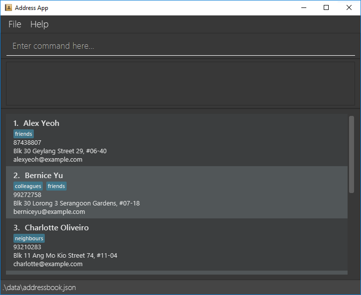

> **Development note:** This v1.2 increment implements Ian's `list` and `clear` features.
> Other commands retain their existing AB3 behaviour. Member cards use a beige, labelled, wrapping layout.
> TrackCall-specific requirements are listed in the [Developer Guide](DeveloperGuide.md#appendix-requirements).
> Planned features, such as tag filtering and bulk tag editing, are not available in this starter version.

AddressBook Level 3 (AB3) is a **desktop application for managing contacts, optimized for use through a Command Line Interface (CLI)** while retaining the benefits of a Graphical User Interface (GUI). If you type quickly, AB3 can help you manage contacts faster than traditional GUI applications.

* Table of Contents
{:toc}

--------------------------------------------------------------------------------------------------------------------

## Quick start

1. Ensure that Java `25` or later is installed on your computer. 
   **Mac users:** Ensure you have the precise JDK version prescribed [here](https://se-education.org/guides/tutorials/javaInstallationMac.html).

1. Use the **team's** application, not the upstream AB3 release. During v1.1 there is no team release JAR.
   Developers can clone the [team repository](https://github.com/AY2627S1-CS2103T-W12-1/tp),
   run `./gradlew shadowJar` (Windows: `gradlew.bat shadowJar`), and use `build/libs/addressbook.jar`.
   Future published builds will appear on the [team releases page](https://github.com/AY2627S1-CS2103T-W12-1/tp/releases).

1. Copy the file to the folder you want to use as the _home folder_ for your AddressBook.

1. Open a terminal, `cd` to the folder containing the JAR file, and run `java -jar addressbook.jar`. 
   A GUI similar to the one below should appear in a few seconds. Note how the app contains some sample data. 
   

1. Type a command in the command box and press Enter to execute it. For example, type **`help`** and press Enter to open the help window. 
   Some example commands you can try:

   * `list` : Lists all contacts.

   * `add n/John Doe p/98765432 e/johnd@example.com a/John street, block 123, #01-01` : Adds a contact named `John Doe` to the Address Book.

   * `delete 3` : Deletes the 3rd contact shown in the current list.

   * `clear` : Deletes all contacts.

   * `exit` : Exits the app.

1. Refer to the [Features](#features) section below for details of each command.

--------------------------------------------------------------------------------------------------------------------

## Features

**:information_source: Notes about the command format:** 

* Words in `UPPER_CASE` are the parameters to be supplied by the user. 
  For example, in `add n/NAME`, replace `NAME` with a value such as `John Doe`.

* Items in square brackets are optional. 
  For example, `n/NAME [t/TAG]` can be used as `n/John Doe t/friend` or as `n/John Doe`.

* Items followed by `…`​ can appear zero or more times. 
  For example, `[t/TAG]…​` may be omitted, or written as `t/friend` or `t/friend t/family`.

* Parameters can be in any order. 
  For example, if the command specifies `n/NAME p/PHONE_NUMBER`, `p/PHONE_NUMBER n/NAME` is also acceptable.

* `list` and `clear` reject any extra arguments. Leading and trailing spaces or tabs are accepted. 
  The existing `help` and `exit` commands still ignore extra arguments.

* If you are using a PDF version of this document, be careful when copying and pasting commands that span multiple lines as space characters surrounding line-breaks may be omitted when copied over to the application.

### Viewing help: `help`

Shows a message explaining how to access the help page.

Format: `help`

### Adding a person: `add`

Adds a person to the address book.

Format: `add n/NAME p/PHONE_NUMBER e/EMAIL a/ADDRESS [t/TAG]…​`

:bulb: **Tip:**
A person can have any number of tags, including zero.

Examples:
* `add n/John Doe p/98765432 e/johnd@example.com a/John street, block 123, #01-01`
* `add n/Betsy Crowe t/friend e/betsycrowe@example.com a/Newgate Prison p/1234567 t/criminal`

### Listing all persons: `list`

Displays every member in the existing address-book order, with consecutive list numbers starting at 1.
It clears the active search or filter without changing records or saving the data file.
Names, phone numbers, emails, addresses, and tags appear in labelled, wrapping member cards;
scroll to reach members that do not fit on screen. A member without tags has no tag labels.

Format: `list`

* One member: `Showing 1 member.`
* Multiple members: `Showing N members.`
* Empty roster: `No members in the address book.`
* `find Tan`, followed by `list`, restores every member, including when the search found no matches.
* Repeating `list` gives the same order and count until the data changes. Use the newly displayed
  indices for subsequent commands.
* `list 1`, `list John`, and `list t/committee` report `Invalid command format. Usage: list`.
  Invalid input preserves the previous view and records. `LIST` and `li st` are unknown commands.
* Listing still works if saving is unavailable; it never writes the member file.

### Editing a person: `edit`

Edits an existing person in the address book.

Format: `edit INDEX [n/NAME] [p/PHONE] [e/EMAIL] [a/ADDRESS] [t/TAG]…​`

* Edits the person at the specified `INDEX`. The index refers to the index number shown in the displayed person list. The index **must be a positive integer** 1, 2, 3, …​
* At least one of the optional fields must be provided.
* Existing values will be updated to the input values.
* When editing tags, all of the person's existing tags are removed; adding tags is not cumulative.
* To remove all of a person's tags, enter `t/` without a tag after it.

Examples:
*  `edit 1 p/91234567 e/johndoe@example.com` Edits the phone number and email address of the 1st person to be `91234567` and `johndoe@example.com` respectively.
*  `edit 2 n/Betsy Crower t/` Edits the name of the 2nd person to be `Betsy Crower` and clears all existing tags.

### Locating persons by name: `find`

Finds persons whose names contain any of the given keywords.

Format: `find KEYWORD [MORE_KEYWORDS]`

* The search is case-insensitive; for example, `hans` matches `Hans`.
* Keyword order does not matter; for example, `Hans Bo` matches `Bo Hans`.
* The search considers only names.
* Only full words match; for example, `Han` does not match `Hans`.
* Persons matching at least one keyword are returned (an `OR` search); for example, `Hans Bo` returns `Hans Gruber` and `Bo Yang`.

Examples:
* `find John` returns `john` and `John Doe`
* `find alex david` returns `Alex Yeoh`, `David Li` 
  

### Deleting a person: `delete`

Deletes the specified person from the address book.

Format: `delete INDEX`

* Deletes the person at the specified `INDEX`.
* The index refers to the index number shown in the displayed person list.
* The index **must be a positive integer** 1, 2, 3, …​

Examples:
* `list` followed by `delete 2` deletes the 2nd person in the address book.
* `find Betsy` followed by `delete 1` deletes the 1st person in the results of the `find` command.

### Clearing all entries: `clear`

Permanently removes every member, including members hidden by a search or filter, and saves an empty roster.
The data file remains in place and application settings are preserved. There is no confirmation or undo;
recovering after a successful clear requires a backup made beforehand.

Format: `clear`

* One member removed: `Cleared 1 member. The address book is now empty.`
* Multiple members removed: `Cleared N members. The address book is now empty.`
* Already empty: `The address book is already empty. No changes were made.`
* The count includes hidden members. `find Tan`, followed by `clear`, removes the entire roster,
  even when the search matched nobody.
* A successful clear resets the search/filter. Restarting loads the saved empty roster.
* An already-empty roster is still saved. Success is reported only after the save succeeds.
* `clear 1`, `clear John`, `clear stop`, and `clear t/committee` are rejected with
  `Invalid command format. Usage: clear. This command removes all members.` No state changes.
* If saving fails, the result is `Unable to clear the address book because the changes could not be saved. No members were removed.`
  The prior records, displayed list, filter, and saved file are preserved. Fix the storage problem
  and retry `clear` if you still intend to remove all members.

### Exiting the program: `exit`

Exits the program.

Format: `exit`

### Saving the data

AddressBook automatically saves after every successful command except `list` in this increment.
You do not need to save manually. The shared writer uses atomic replacement so a failed write
preserves the previous file. A failed `clear` also restores the previous in-memory roster and view.

### Editing the data file

AddressBook data is saved automatically as a JSON file `data/addressbook.json`, relative to the folder from which you start the app.
Start it from the same folder each time to use the same records.
Close the app and back up the file before editing it. The current starter uses a `persons` array
and each person has `name`, `phone`, `email`, `address`, and `tags` fields.
The proposed TrackCall `tagged` schema in the DG is not implemented yet. Advanced users are welcome to update data directly by editing that data file.

:exclamation: **Caution:**
Malformed JSON normally causes AddressBook to start with an empty address book at the next run.
Known defects in the current version mean a JSON `null` root, null person, or null tag can prevent startup instead.
Close the app and repair the file or restore your backup if startup fails.
The invalid file remains on disk until you run a successful command (AddressBook saves after every successful command except `list`). 
Furthermore, certain edits can cause the AddressBook to behave in unexpected ways (e.g., if a value entered is outside of the acceptable range). Therefore, edit the data file only if you are confident that you can update it correctly.

### Filtering persons by tag `[coming soon]`

Displays members with a specified tag without changing or deleting member data.

--------------------------------------------------------------------------------------------------------------------

## FAQ

**Q**: How do I transfer my data to another computer? 
**A**: Install the app on the other computer and overwrite the data file it creates with the data file from your previous AddressBook home folder.

--------------------------------------------------------------------------------------------------------------------

## Known issues

1. **When using multiple screens**, if you move the application to a secondary screen, and later switch to using only the primary screen, the GUI will open off-screen. The remedy is to delete the `preferences.json` file created by the application before running the application again.
2. **If you minimize the Help Window** and then run the `help` command (or use the `Help` menu, or the keyboard shortcut `F1`) again, the original Help Window will remain minimized, and no new Help Window will appear. The remedy is to manually restore the minimized Help Window.

--------------------------------------------------------------------------------------------------------------------

## Command summary

Action | Format, Examples
--------|------------------
**Add** | `add n/NAME p/PHONE_NUMBER e/EMAIL a/ADDRESS [t/TAG]…​`   e.g., `add n/James Ho p/22224444 e/jamesho@example.com a/123, Clementi Rd, 1234665 t/friend t/colleague`
**Clear** | `clear`
**Delete** | `delete INDEX`  e.g., `delete 3`
**Edit** | `edit INDEX [n/NAME] [p/PHONE_NUMBER] [e/EMAIL] [a/ADDRESS] [t/TAG]…​`  e.g., `edit 2 n/James Lee e/jameslee@example.com`
**Find** | `find KEYWORD [MORE_KEYWORDS]`  e.g., `find James Jake`
**List** | `list`
**Help** | `help`
**Exit** | `exit`
