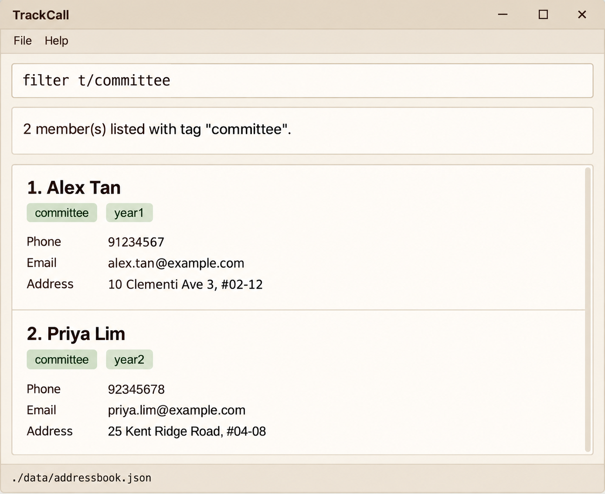

TrackCall helps membership secretaries keep their organisation's member records up to date.
The planned performance target is 500 members; this is not a hard record limit.
Use typed commands to manage contact details, find members, and organise groups.

## Planned interface

This AI-assisted mockup shows the intended product, including planned tag filtering.
TrackCall will keep the familiar command box,
result display, member list, and data-file status bar from AB3.
Planned features include filtering members by tag and adding or removing a tag for everyone
in the displayed list. Changes will be saved locally.

## Current development version

The v1.2 working build manages member records in a light beige interface, shows readable contact
details and command results, and includes offline help for all eight supported commands. Successful
data changes are saved locally; save errors explain recovery, and a failed clear restores the roster.
Read-only commands leave the roster file unchanged. Tag filtering and bulk tag changes remain planned.

The image above is a product mockup, not a screenshot of this build.

* [User Guide](UserGuide.html): how to use the development build.
* [Developer Guide](DeveloperGuide.html): current implementation and planned TrackCall requirements.
* [Setup instructions](SettingUp.html): how to run and develop the application.
* [About Us](AboutUs.html): the project team.

## Acknowledgements

Based on [AddressBook Level 3](https://se-education.org/addressbook-level3)
from the [SE-EDU initiative](https://se-education.org).
